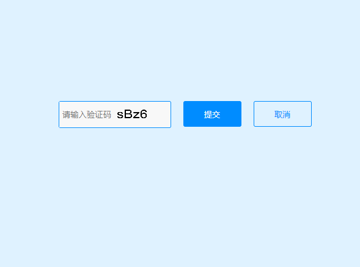

# H5验证码VerificationCode

效果如下：



HTML code:

```
<!Doctype html>
<html lang="en">
<head>
    <meta charset="UTF-8">
	<link rel="stylesheet" href="css/details.css"/>
	<title>验证码</title>
</head>
<body>
<div class="ddetails-header">
	<div class="ddetails-con">
		<div class="J_after">
			<input type="hidden"  id="J_down" data-link="'+data.downUrl+'">
			<div class="checkcode">
				<input type="text" id="J_codetext" placeholder="请输入验证码" maxlength="4">
				<canvas class="J_codeimg" id="myCanvas" onclick="createCode()">
					您的浏览器不支持canvas元素。
				</canvas>
			</div>
			<input type="button" value="提交" class="btn-code" onClick="validate();">
			<input type="button" value="取消" class="btn-code btn-no">
		</div>
	</div>
</div>
</body>
</html>
<script src="js/jquery-1.9.1.min.js"></script>
<script src="js/index.js"></script>
```

css code:
```
/* 
  Style for devices-deatail, latest modified 2015-10-23 15:56
  By yanbo
*/
body{
	padding: 0;
	margin: 0;
	border: 0;
	color: #585858;
	font-size: 14px;
}
h1,h2,ul,li,input{
	margin: 0;
	padding: 0;
	border: none;
	list-style:none;
	text-decoration: none;
}
.ddetails-header{
	width: 100%;
	/*height: 507px;*/
	height: 700px;
	padding-top: 45px;
	background: #dff2ff;
}
.ddetails-con{
	/*margin:114px auto;*/
	margin: 190px auto;
	width: 960px;
	height: 278px;
}
.btn{
	float: left;
	display: block;
	text-align: center;
	text-decoration: none;
	list-style: none;
	vertical-align: middle;
	margin-top: 12px;
	margin-right: 21px;
	width: 120px;
	height: 42px;
	line-height: 42px;
	background: #008cff;
	border-radius: 3px;
	color: #fff;
	font-size: 16px;
}
/*check-code*/
.checkcode{
	float: left;
	margin-top: 10px;
	width: 182px;
	height: 42px;
	border: 1px solid #008cff;
	border-radius: 3px;
	background: #fff;
}
.checkcode input{
	float: left;
	text-align: center;
	width: 85px;
	height: 36px;
	padding: 3px;
	color: #000;
}
.checkcode canvas{
	float: right;
	width: 85px;
	height: 36px;
	padding: 3px;
}
.btn-code{
	margin-top: 10px;
	display: block;
	float: left;
	width: 95px;
	height: 42px;
	margin-left: 20px;
	background: #008cff;
	color: #fff;
	border-radius: 3px;
}
.btn-no{
	background: none;
	border: 1px solid #008cff;
	border-radius: 3px;
	color: #008cff;
}
.btn:hover{
	text-decoration: none;
	cursor: pointer;
}
```

javascript code：
```
/*-----------------------------------------------------------------------------
 * @Description: 验证码
 * @author: 	yanbo(yanbo@yeah.net)
 * @date		2015.09.24
 * ---------------------------------------------------------------------------*/
function showCheck(a) { /* 显示验证码图片 */
    var c = document.getElementById("myCanvas");
    var ctx = c.getContext("2d");
    ctx.clearRect(0, 0, 1000, 1000);
    ctx.font = "80px Arial";
    ctx.fillText(a, 0, 100);
}

var code; //在全局 定义验证码      
function createCode() {
    code = "";
    var codeLength = 4; //验证码的长度
    var selectChar = new Array(1, 2, 3, 4, 5, 6, 7, 8, 9, 'a', 'b', 'c', 'd', 'e', 'f', 'g', 'h', 'j', 'k', 'l', 'm', 'n', 'p', 'q', 'r', 's', 't', 'u', 'v', 'w', 'x', 'y', 'z', 'A', 'B', 'C', 'D', 'E', 'F', 'G', 'H', 'J', 'K', 'L', 'M', 'N', 'P', 'Q', 'R', 'S', 'T', 'U', 'V', 'W', 'X', 'Y', 'Z');

    for (var i = 0; i < codeLength; i++) {
        var charIndex = Math.floor(Math.random() * 60);
        code += selectChar[charIndex];
    }
    if (code.length != codeLength) {
        createCode();
    }
    showCheck(code);
}


function validate() {
    var inputCode = document.getElementById("J_codetext").value.toUpperCase();
    var codeToUp = code.toUpperCase();
    if (inputCode.length <= 0) {
        document.getElementById("J_codetext").setAttribute("placeholder", "请输入验证码");
        createCode();
        return false;
    } else if (inputCode != codeToUp) {
        document.getElementById("J_codetext").value = "";
        document.getElementById("J_codetext").setAttribute("placeholder", "错误");
        createCode();
        return false;
    } else {
        window.open(document.getElementById("J_down").getAttribute("data-link"));
        document.getElementById("J_codetext").value = "";
        createCode();
        return true;
    }

}

// download
$(document).ready(function() {
    createCode();
    });
//为确定按钮添加回车事件
document.onkeydown=function(event){
    var e = event || window.event || arguments.callee.caller.arguments[0];
    if(e && e.keyCode==13){ // enter 键
        validate();
    }
};
```
